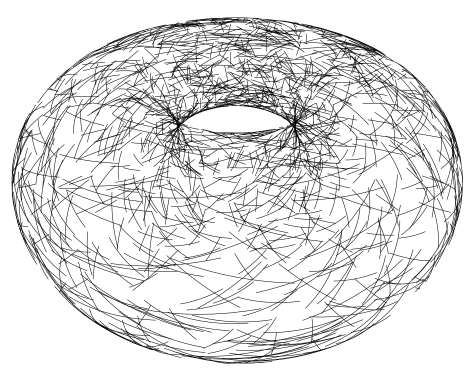
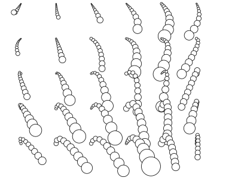

This repo started as an attempt to do level plots in Python

***
# Torus curves
See also my post here - https://puhachov.xyz/projects/BezierCurve_to_SVG_in_Blender/

* `blender_curve_on_torus.py` - example, creates a curve winding a torus
* `blender_curve_rendering_script.py` - a script to render only visible parts of curves to svg

*** 
# Perlin noise circles field
Perlin noise implementation from https://github.com/pvigier/perlin-numpy/blob/master/perlin_numpy/perlin2d.py



* `grass_field.py` generates random curves
* `curve_circles.py` samples circles along curves from svg file

***
# No banana
Inspired by marching cubes algo - we work with negative space.

 * see `nobanana.py`, uses Shapely to do operations on shapes
***
# QuickDraw 2d projection

Dependencies:
 * https://github.com/stefankoegl/kdtree - KDtree for downsampling dense 2d clouds
```
pip install kdtree
```
* `eu_autoencoder.py` 
* `sample_projections.py` to downsample dense 2d projections
* `draw_quickdraw_projections.py` to make svg file
* `vpype read test_donutonionappleleaflollipop.svg linesort write test.svg` to sort the lines (faster drawing)