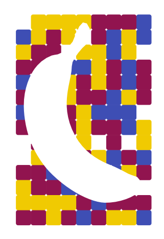
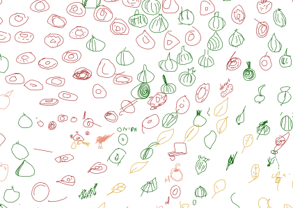

This repo started as an attempt to do level plots in Python

*** 
# Perlin noise circles field


***
# No banana
Inspired by marching cubes algo - we work with negative space.

see `nobanana.py` 
***
# QuickDraw 2d projection

Dependencies:
 * https://github.com/stefankoegl/kdtree - KDtree for downsampling dense 2d clouds
```
pip install kdtree
```
* `eu_autoencoder.py` 
* `sample_projections.py` to downsample dense 2d projections
* `draw_quickdraw_projections.py` to make svg file
* `vpype read test_donutonionappleleaflollipop.svg linesort write test.svg` to sort the lines (faster drawing)